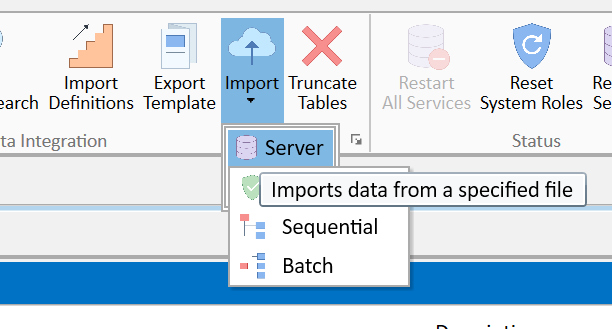

# Objectives

The necessary components to deploy a new functionality are grouped in a
package where all the various components can be found. For the time
being this package is made of:

1.  SQL Wrappers
2.  Static Data / Config Upload
3.  Examples/test to verify the functionality

By deploying the various components in the proposed order, it should be
easy to create on a different environment the exact functionalities. In
the case of that component, the deployment has been tested:

-   locally on an unrelated database
-   for a customer on its environment - in that case Colmore

# Package objectives

# Deployment

Each party should be deployed used in the order described

On a database where accounting is +/- similar

## Step 1 - SQL Wrapper

 Just select the xml file which have
been previously exported. Note that by default choosing
Import/Server/Sequential the files presentes are xlsx files. In that
case, it is necessary to select XML. As a result 4 SQL Wrappers will be
created.

PS: As per 2022-04-03 there is a bug regarding the indexing/order of the
parameter. Some verification should be made to verify that the
parameters (the first 4) are in the expected order
Account/Canvas/Team/As Of. That should be the case but as long as the
underlying bug is not sorted out some issues may appear.

As a result the 4 SQL Wrappers will be deployed. Their description is
all prefixed by COLT (for COLmore Transactions) and thus could be found
easily.

## Step 2 - Transaction Type Value

It takes probably 3 mns+ for the upload to be successful. Refresh All
and then check the Transaction Code

## Step 3 - Create the Instruments

Test the upload of the example spreadsheet

## Step 4

Upload the test spreadsheets
